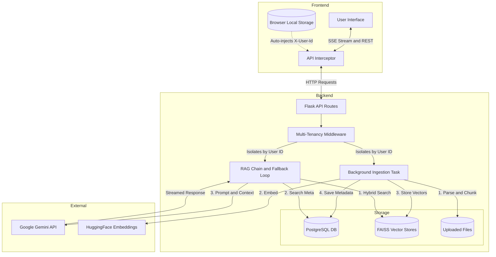

# AskMyDocs (AI Document Summarizer)

A modern, production-ready Retrieval-Augmented Generation (RAG) web application that allows users to instantly chat with and analyze their documents. Built with a highly responsive React frontend and a robust Python and Flask backend.

## Key System Features

- **Zero-Login Multi-Tenancy**: Users can visit the application and instantly start uploading documents. The frontend assigns anonymous, persistent UUIDs stored in browser local storage. Every API request attaches this ID, isolating every user's documents, vector databases, and chat history entirely on the backend without forcing account creation.
- **Resilient AI Generation**: Integrates with Google's Gemini API models (gemini-3.8-flash, gemini-3.5-flash, gemini-3.0-flash). The backend features an automatic retry and fallback mechanism that catches 503 High Demand or Rate Limit errors and gracefully switches models or delays and retries without breaking the user experience.
- **Real-time SSE Streaming**: Answers stream back to the User Interface token-by-token using Server-Sent Events. Mid-stream errors are caught and appended to the chat interface cleanly.
- **Precise Source Attribution**: The AI provides exact snippets of the paragraphs it used to formulate its answer. Users can click on source cards to view the fully extracted text in a dedicated Preview Panel.
- **Multi-Format Background Uploads**: Supports PDF, DOCX, PPTX, CSV, Excel, TXT, and Images. Runs background ingestion threads for fast processing without locking the user interface.

## System Architecture



## Setup Instructions

### 1. Prerequisites
- Python 3.9 or higher
- Node.js 18 or higher
- PostgreSQL database running locally (or via a cloud provider like Supabase)

### 2. Backend Setup
Navigate to the backend directory and set up a virtual environment:
```bash
cd backend
python -m venv venv

# Windows
venv\Scripts\activate
# Mac or Linux
source venv/bin/activate

pip install -r requirements.txt
```

Create a `.env` file in the `backend` folder containing your credentials:
```env
DB_NAME=askmydocs
DB_USER=postgres
DB_PASSWORD=your_password
DB_HOST=127.0.0.1
DB_PORT=5432
GEMINI_API_KEY=your_gemini_api_key
```

Run the API server:
```bash
python main.py
```

### 3. Frontend Setup
Open a new terminal window:
```bash
cd frontend
npm install
npm run dev
```
Visit the local server address provided by Vite in your browser.

