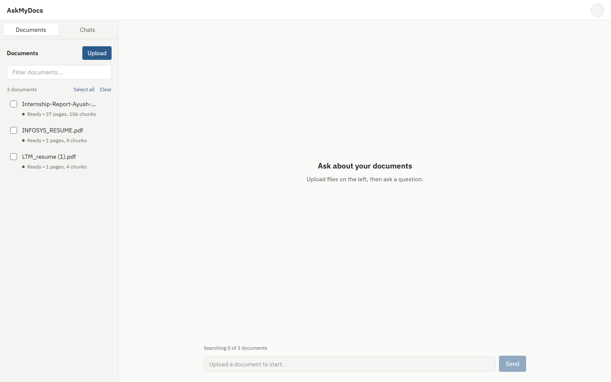
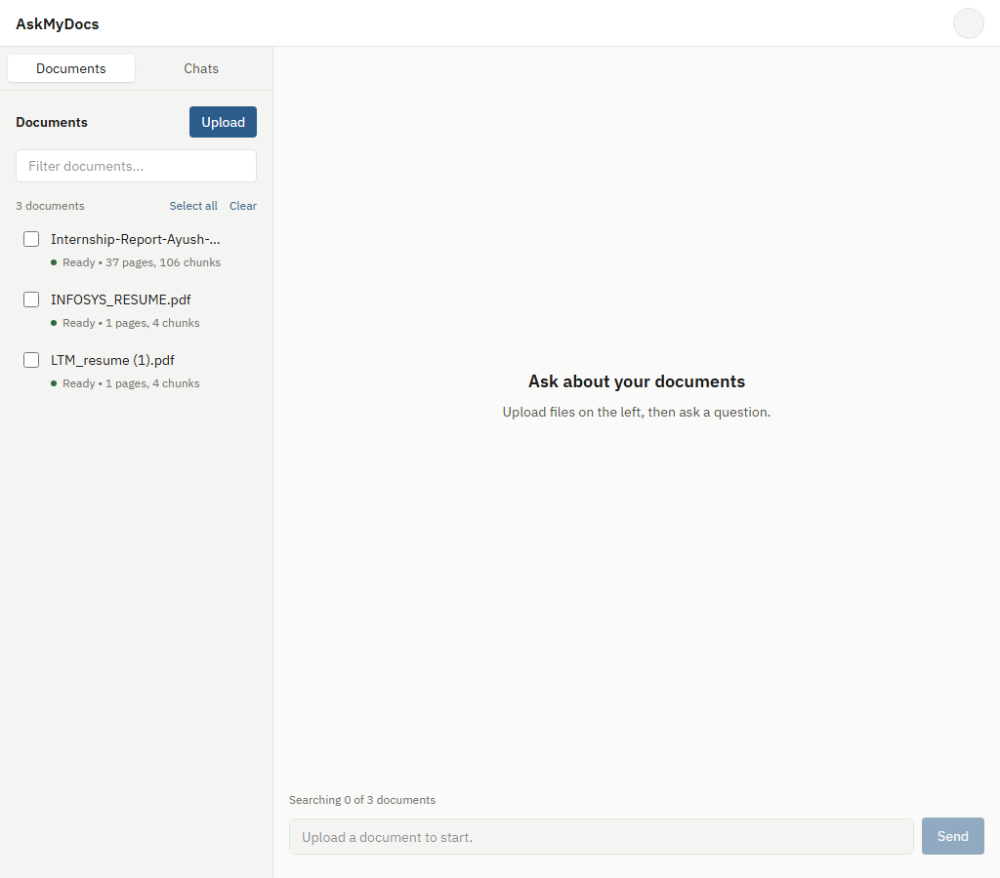
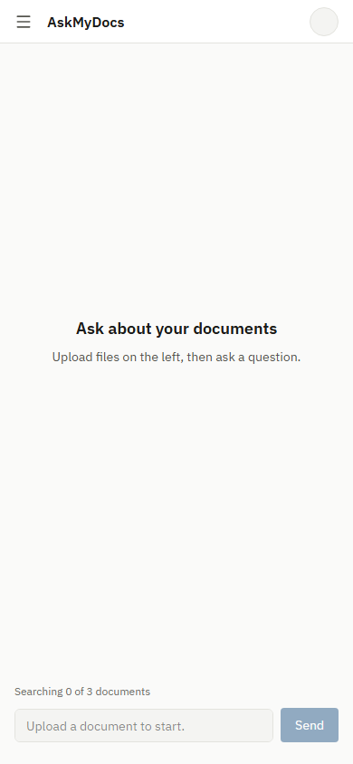

# AskMyDocs (formerly DocuMind)

A fully-featured, interview-ready local RAG (Retrieval-Augmented Generation) application built with React, Flask, LangChain, and PostgreSQL. It allows you to chat with multiple documents simultaneously using hybrid search (FAISS + BM25) and local HuggingFace embeddings.

## Features
- **Multi-File Uploads:** Drag and drop up to 10 files (PDF, DOCX, PPTX, CSV, Excel, TXT, MD, images).
- **Background Ingestion:** Non-blocking chunking and embedding, complete with progress polling (`Page X of Y`).
- **Hybrid Retrieval:** In-memory BM25 combined with persistent isolated FAISS indexes per document.
- **Smart OCR:** Automatically extracts text or OCRs scanned PDF pages and images using Gemini Multimodal APIs.
- **SSE Streaming Chat:** Fast, token-by-token streaming of answers back to the UI with exact source attribution.

## Setup Instructions

### 1. Prerequisites
- Python 3.9+
- Node.js 18+
- PostgreSQL database running locally

### 2. Database Setup
Create a PostgreSQL database (e.g. `askmydocs`) and configure your credentials.

### 3. Backend Setup
```bash
cd backend
python -m venv venv
# Windows: venv\Scripts\activate | Mac/Linux: source venv/bin/activate
pip install -r requirements.txt

# Create a .env file based on the config:
echo "DB_NAME=askmydocs" > .env
echo "DB_USER=postgres" >> .env
echo "DB_PASSWORD=your_password" >> .env
echo "GOOGLE_API_KEY=your_gemini_api_key" >> .env

# Run the server
python main.py
```

### 4. Frontend Setup
```bash
cd frontend
npm install
npm run dev
```

## Architecture & Decisions
Please read [docs/DECISIONS.md](docs/DECISIONS.md) and [docs/CURRENT_STATE.md](docs/CURRENT_STATE.md) for my architecture decisions and reasons behind the tech stack choices (perfect for interview discussions).

## Evaluation
You can run the local evaluation script to check precision and recall against a dummy dataset:
```bash
cd backend
python eval/eval.py
```

## Testing
This project includes a pytest suite with mocked LLM and DB calls:
```bash
cd backend
pytest tests/test_api.py -v
```

## Frontend

The frontend is a clean, responsive React application built with Tailwind CSS. It features a document management sidebar, a conversational interface, and a source preview panel.

### Desktop (1440px)


### Tablet (1024px)


### Mobile (390px)
